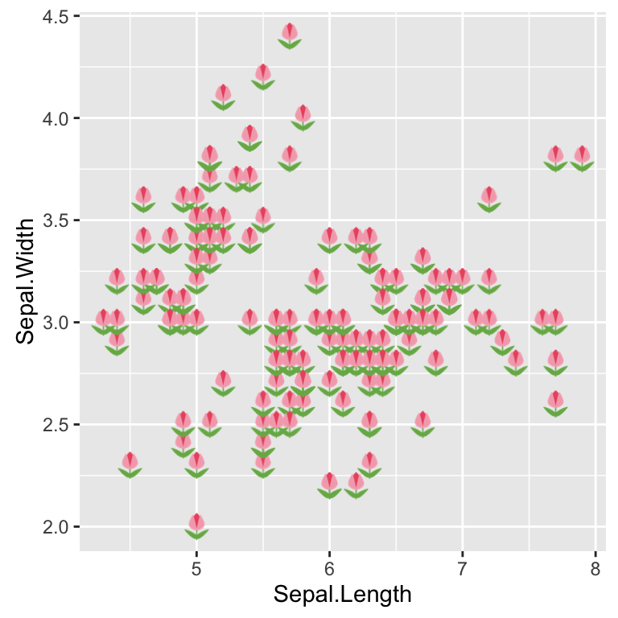
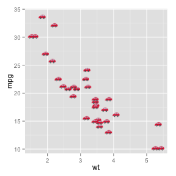
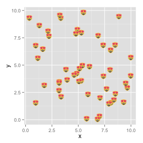
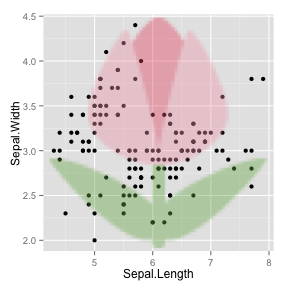

<!-- README.md is generated from README.Rmd. Please edit that file -->
emoGG(plot)
===========

Use emoji in your `ggplot2` plots.

This is silly.

Installation
------------

    devtools::install_github("dill/emoGG")

`ggplot2` versions
------------------

Note that this branch works with `ggplot2` version 2 or higher, now
available on CRAN. If you have an older version of `ggplot2` please look
at the `ggplot2-pre2` branch.

Usage
-----

    library(ggplot2)
    library(emoGG)

First need to find an emoji, using the `emoji_search` function. First
look for a tulip:

    emoji_search("tulip")
    #>          emoji  code keyword
    #> 626      tulip 1f337 flowers
    #> 627      tulip 1f337   plant
    #> 628      tulip 1f337  nature
    #> 629      tulip 1f337  summer
    #> 630      tulip 1f337  spring
    #> 3051 copyright    a9      ip

The `iris` example with **real** irises (well, tulips...)

    ggplot(iris, aes(Sepal.Length, Sepal.Width, color = Species)) +
      geom_emoji(emoji="1f337")

What about plotting `mtcars` with **real** cars?

    ggplot(mtcars, aes(wt, mpg))+ geom_emoji(emoji="1f697")

Some random cats?

    posx <- runif(50, 0, 10)
    posy <- runif(50, 0, 10)
    ggplot(data.frame(x = posx, y = posy), aes(x, y)) + geom_emoji(emoji="1f63b")

We can also just put a big emoji in the background:

    qplot(x=Sepal.Length, y=Sepal.Width, data=iris, geom="point") + add_emoji(emoji="1f337")

Acknowledgements
----------------

Emoji lookup is from @muan's
[`emojilib`](https://github.com/muan/emojilib).

Emoji are loaded from a CDN using Twitter's
[`twemoji`](https://github.com/twitter/twemoji), which is [CC-BY
4.0](https://creativecommons.org/licenses/by/4.0/) licensed. You can get
attribution details [on the project
page](https://github.com/twitter/twemoji#attribution-requirements).

With apologies, DLM.
